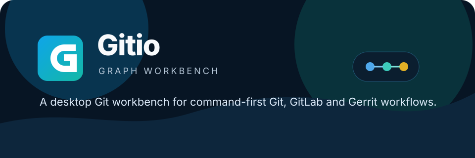

<p align="center">
  
</p>

<h1 align="center">Gitio</h1>

<p align="center">
  <strong>A desktop Git graph workbench for command-first workflows.</strong>
</p>

<p align="center">
  
</p>

<p align="center">
  
  
  
  
  
  
</p>

<p align="center">
  Gitio 是一个面向 PC 端的 Git 桌面工作台。它不试图隐藏 Git 命令，而是把仓库状态、分支、提交图谱、配置文件和常用操作放进一个清晰的桌面界面里。
</p>

## 功能概览

- 仓库工作台：支持收藏多个本地仓库，切换后自动加载对应分支、提交线、`.git` 文件和 config。
- 提交图谱：按当前选中分支展示提交线，支持点击提交查看详情，merge 线使用 SVG lane 绘制。
- 命令确认：所有 Git 命令执行前都会弹出确认框，并展示完整命令，避免误操作。
- 常用 Git 操作：内置 fetch、pull、push、status、stage、commit、amend、show、log 等入口。
- 自定义命令：支持保存常用命令，也支持为每个仓库单独保存 push 指令，适配 GitLab 和 Gerrit 工作流。
- `.git` 浏览：可以查看当前仓库真实 `.git` 目录，支持 worktree/submodule 的 gitfile 场景。
- Config 编辑：支持读取、编辑和保存仓库 `.git/config` 与全局 `.gitconfig`。
- 明暗色主题：提供清爽的亮色和深海蓝暗色主题，使用太阳/月亮图标切换。
- 在线更新：标题栏展示当前版本，启动时自动检查 GitHub Release，有新版本时高亮提示并支持下载、安装和重启。

## 界面结构

Gitio 当前采用三栏工作台布局：

- 左侧：仓库收藏、当前分支选择、已保存命令。
- 中间：当前分支提交图谱和提交行列表。
- 右侧：Inspector，用于查看提交、执行命令、浏览 `.git` 文件、编辑 config。

## 技术栈

- Tauri 2：桌面应用壳、本地目录选择和 Rust 后端命令桥接。
- Vue 3 + TypeScript：前端界面、状态和组件组织。
- Naive UI：按钮、输入框、滚动条、弹窗和反馈组件。
- TailwindCSS + SCSS：三栏布局、主题变量和局部视觉样式。
- Axios：预留 GitLab/Gerrit REST API 扩展层。
- Git CLI：所有 Git 行为最终通过本机 Git 执行，尽量保持和命令行一致。

## 快速开始

### 环境要求

- Node.js >= 20
- npm >= 10
- Rust 工具链
- 系统已安装 Git，并且 `git` 可以在终端中访问

### 安装依赖

```bash
npm install
```

### 启动开发环境

```bash
npm run tauri:dev
```

### 前端构建检查

```bash
npm run build
```

### 桌面应用构建

```bash
npm run tauri:build
```

启用 updater artifacts 后，完整桌面构建需要设置 `TAURI_SIGNING_PRIVATE_KEY`。如果密钥带密码，还需要设置 `TAURI_SIGNING_PRIVATE_KEY_PASSWORD`。未设置私钥时，本地可能已生成 MSI/NSIS 安装包，但会在 updater 签名产物阶段失败。

## 发布与在线更新

在线更新使用 Tauri 官方 updater 插件，更新源指向 GitHub Release：

```text
https://github.com/Msg-Lbo/gitio/releases/latest/download/latest.json
```

发布流程通过 `.github/workflows/release.yml` 完成：

- 手动触发 workflow 可更新版本号、归档 changelog 并创建 tag。
- 推送 `v*.*.*` tag 后会构建 Windows、Linux、macOS 安装包。
- `tauri-apps/tauri-action` 会上传安装包和 updater JSON 到 GitHub Release。
- Tauri updater 需要签名密钥，仓库 Secrets 需配置 `TAURI_SIGNING_PRIVATE_KEY`，如密钥带密码还需配置 `TAURI_SIGNING_PRIVATE_KEY_PASSWORD`。
- Windows 安装包使用 NSIS，支持用户级/机器级安装，并显示中英文语言选择。

## 项目结构

```text
gitio/
├─ src/
│  ├─ components/              # 工作台 UI 组件
│  ├─ composables/             # 提交图谱和工作台状态逻辑
│  ├─ data/                    # Git/GitLab/Gerrit 命令模板
│  ├─ services/                # Tauri 命令调用和 HTTP 预留层
│  ├─ styles/                  # Tailwind 和 SCSS 主题样式
│  └─ types/                   # Git 数据结构类型
├─ src-tauri/
│  ├─ src/lib.rs               # Rust 后端 Git CLI 命令实现
│  └─ tauri.conf.json          # Tauri 应用配置
├─ docs/assets/                # README 图形资源
├─ scripts/release.mjs         # 版本发布辅助脚本
├─ CHANGELOG.md
├─ PROGRESS.md
└─ PROMPT.md
```

## 架构说明

前端通过 `src/services/gitApi.ts` 调用 Tauri command，后端在 `src-tauri/src/lib.rs` 中使用本地 Git CLI 读取仓库信息或执行命令。这样可以覆盖普通 Git、GitLab 特殊 ref、Gerrit `refs/for/*` 等团队自定义参数。

核心状态按领域拆分在 `src/composables/workbench/`：

- `state.ts`：共享状态和计算属性。
- `useRepositories.ts`：仓库收藏和切换。
- `useRepositoryData.ts`：仓库概览、分支和提交线。
- `useCommands.ts`：命令确认、执行和自定义命令。
- `useGitFiles.ts`：`.git` 文件浏览和保存。
- `useConfigFiles.ts`：Git config 读取和保存。
- `useTheme.ts`：明暗色主题。
- `src/composables/useAppUpdater.ts`：应用版本读取、更新检查、下载进度和安装重启。

## 安全边界

- Gitio 不保存 Git 账号、密码、Token 或 SSH 私钥。
- 命令执行前会显示完整命令并等待确认。
- 不建议在命令中心运行需要交互式编辑器的 Git 命令，例如未配置编辑器时的交互式 rebase。
- `.git` 文件和 config 保存能力面向熟悉 Git 内部结构的用户，修改前请确认当前仓库状态。

## 当前状态

项目处于早期可用阶段，核心工作台、命令执行、提交图谱、仓库配置和 `.git` 浏览已经实现。后续重点会放在冲突辅助、命令历史、GitLab/Gerrit API 配置和更完整的长任务反馈上。
